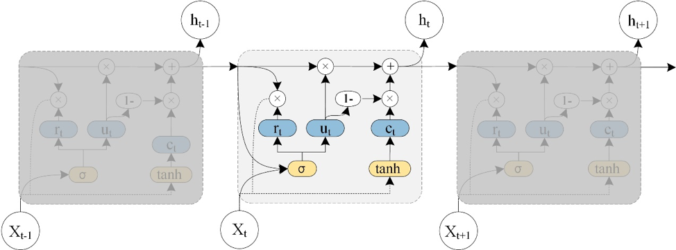

# T-GCN: 基于时序图卷积网络的交通预测方法

本项目基于 [lehaifeng/T-GCN](https://github.com/lehaifeng/T-GCN) 仓库，适配 **PeMS D12（加州橙县）** 传感器数据，用于交通速度预测并与路径规划系统集成。

## 概述

T-GCN 模型同时捕获交通数据中的**空间依赖性**和**时间依赖性**：

- **空间建模**：使用图卷积网络（GCN）学习路网拓扑结构，捕获传感器间的空间关系
- **时间建模**：使用门控循环单元（GRU）学习交通数据的动态变化规律

<p align="center">
  
</p>

## 仓库结构

```
TGCN/
├── T-GCN-master/              # 原始参考代码（TensorFlow + PyTorch 版本）
├── tgcn_pytorch/              # 适配 PeMS D12 的 PyTorch 实现 ★
│   ├── models/                # 模型定义
│   │   ├── tgcn.py            # T-GCN 模型（GCN + GRU）
│   │   ├── gru.py             # GRU 基线模型
│   │   └── gcn.py             # GCN 基线模型
│   ├── utils/                 # 工具函数
│   │   ├── graph_conv.py      # 图拉普拉斯矩阵计算
│   │   ├── metrics.py         # 评估指标（RMSE/MAE/MAPE/R2）
│   │   └── losses.py          # 损失函数
│   ├── data/                  # 数据处理
│   │   └── prepare_data.py    # 原始数据解析脚本
│   ├── train.py               # 训练脚本
│   ├── predict.py             # 预测模块（命令行 + Python API）
│   └── requirements.txt       # 依赖
└── data/
    └── d12_data/              # PeMS D12 原始数据
        ├── data/              # 训练数据（2026年1-2月，59天）
        ├── val/               # 验证数据（2026年3月，11天）
        ├── all_stations.txt   # 全部 2587 个传感器
        ├── top500_stations.txt # 按重要性排序前500
        └── top1000_stations.txt
```

## 快速开始

### 1. 安装依赖

```bash
cd tgcn_pytorch
pip install -r requirements.txt
```

### 2. 准备数据

从 PeMS D12 原始 gz 数据中提取速度矩阵和邻接矩阵：

```bash
# 默认: top200 传感器, 2周训练 + 1周验证（推荐配置）
python data/prepare_data.py

# 快速测试: 100 传感器, 7天训练
python data/prepare_data.py --top_n 100 --days 7 --val_days 3

# 较全配置: 300 传感器, 1个月训练
python data/prepare_data.py --top_n 300 --days 30 --val_days 7

# 全量: 500 传感器, 全部数据
python data/prepare_data.py --top_n 500 --days 59 --val_days 11
```

**参数说明：**

| 参数 | 默认值 | 说明 |
|------|--------|------|
| `--top_n` | 200 | 选取传感器数量（按重要性排序） |
| `--days` | 14 | 训练数据天数 |
| `--val_days` | 7 | 验证数据天数 |
| `--threshold` | 3.0 | 邻接矩阵距离阈值（km） |
| `--start_date` | 2026_01_01 | 训练数据起始日期 |

### 3. 训练模型

```bash
# ★ 用 YAML 配置启动（推荐，配置文件在 configs/ 目录下）

# 快速验证（~10分钟）
python train.py --config configs/fast.yaml --config_path data/data_config.json

# 推荐配置（~30-60分钟）
python train.py --config configs/recommended.yaml --config_path data/data_config.json

# 标准训练（~2-3小时）
python train.py --config configs/standard.yaml --config_path data/data_config.json

# 全量训练（~6-8小时）
python train.py --config configs/full.yaml --config_path data/data_config.json

# YAML 配置 + 命令行覆盖（命令行参数优先级更高）
python train.py --config configs/recommended.yaml --epochs 200 --lr 0.002

# 不用配置文件，纯命令行
python train.py --epochs 100 --hidden_dim 64 --config_path data/data_config.json
```

**训练参数：**

| 参数 | 默认值 | 说明 |
|------|--------|------|
| `--model` | TGCN | 模型类型（TGCN/GRU/GCN） |
| `--hidden_dim` | 64 | 隐藏层维度 |
| `--seq_len` | 12 | 输入序列长度（12步 = 1小时） |
| `--pre_len` | 3 | 预测步长（3步 = 15分钟） |
| `--epochs` | 100 | 训练轮数 |
| `--batch_size` | 32 | 批大小 |
| `--lr` | 0.001 | 学习率 |

### 4. 预测

```bash
# 命令行预测
python predict.py --model_path saved_models/TGCN_best.pth

# 指定速度数据文件预测
python predict.py --model_path saved_models/TGCN_best.pth --speed_path data/d12_speed.csv
```

**Python API 调用：**

```python
from predict import TGCNPredictor
import numpy as np

# 加载模型
predictor = TGCNPredictor("saved_models/TGCN_best.pth")

# 使用最近速度数据预测（shape: seq_len × num_nodes）
predictions = predictor.predict(recent_speed_data)
# 返回 shape: pre_len × num_nodes（未来15分钟的速度预测）
```

## 训练时间估算

| 配置 | 传感器 | 训练天数 | 预计 GPU 时间 |
|------|--------|----------|--------------|
| 快速测试 | 100 | 7+3 | ~10 分钟 |
| **推荐** | **200** | **14+7** | **~30-60 分钟** |
| 较全 | 300 | 30+7 | ~2-3 小时 |
| 全量 | 500 | 59+11 | ~6-8 小时 |

> T-GCN 比 DCRNN 等模型轻量很多，200 传感器配置在单 GPU 上通常 1 小时内完成。

## 模型架构

### T-GCN

核心思想是将 GCN 嵌入 GRU 的门控机制中：

1. **TGCNGraphConvolution**：用归一化图拉普拉斯矩阵替代 GRU 中的线性变换
   - 输入拼接 `[x, h]`，经过图卷积 `A[x,h]W + b` 捕获空间依赖
2. **TGCNCell**：类似 GRU 单元，但用图卷积替代全连接层
   - 重置门 `r` 和更新门 `u` 控制信息流
3. **TGCN**：沿时间步展开 TGCNCell，最终通过线性回归层输出预测

### 评估指标

- **RMSE**：均方根误差
- **MAE**：平均绝对误差
- **MAPE**：平均绝对百分比误差
- **R²**：决定系数
- **Accuracy**：`1 - ||y - pred|| / ||y||`

## 原始论文

本实现基于以下论文：

> Ling Zhao, Yujiao Song, Chao Zhang, Yu Liu, Pu Wang, Tao Lin, Min Deng, Haifeng Li. "T-GCN: A Temporal Graph Convolutional Network for Traffic Prediction." *IEEE Transactions on Intelligent Transportation Systems*, 2019.
>
> 论文链接: [IEEE](https://ieeexplore.ieee.org/document/8809901) | [arXiv](https://arxiv.org/abs/1811.05320)

### T-GCN 系列扩展模型

| 模型 | 核心改进 | 发表期刊 |
|------|---------|---------|
| **T-GCN** | GCN + GRU 同时捕获时空依赖 | IEEE T-ITS |
| **A3T-GCN** | 引入注意力机制调整时间步权重 | ISPRS IJGI |
| **AST-GCN** | 融合外部属性（天气、POI） | IEEE Access |
| **KST-GCN** | 融合知识图谱表示 | IEEE T-ITS |
| **STGC-GNNs** | 空间时序 Granger 因果图 | Physica A |
| **LSTTN** | 长短期 Transformer 框架 | Knowledge-Based Systems |
| **STDCformer** | 时空因果去混杂策略 | Information Sciences |

### 基线方法

仓库同时提供以下基线模型用于对比：
1. **HA**（历史平均）
2. **ARIMA**（自回归积分滑动平均）
3. **SVR**（支持向量回归）
4. **GCN**（图卷积网络，仅空间建模）
5. **GRU**（门控循环单元，仅时间建模）

## 引用

```bibtex
@article{zhao2019tgcn,
    title={T-GCN: A Temporal Graph Convolutional Network for Traffic Prediction},
    author={Zhao, Ling and Song, Yujiao and Zhang, Chao and Liu, Yu and Wang, Pu and Lin, Tao and Deng, Min and Li, Haifeng},
    journal={IEEE Transactions on Intelligent Transportation Systems},
    DOI={10.1109/TITS.2019.2935152},
    year={2019}
}
```
